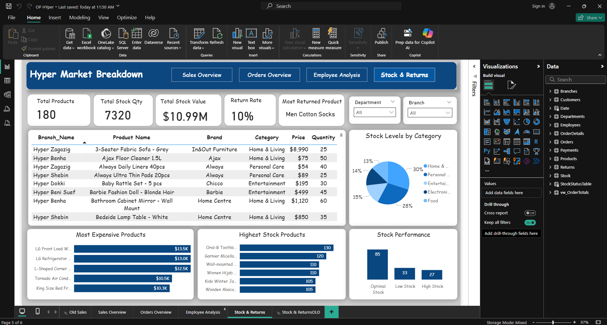

# Hypermarket Dashboard

This Power BI project visualizes hypermarket operations, covering sales, orders, employees, and inventory.  
The dashboard provides actionable insights into business performance, branch operations, and product management.

---

## Dashboard Highlights
- **Sales Overview** → Total sales, branch-wise performance, and category insights.  
- **Orders Analysis** → Tracks order volumes, details, and regional distribution.  
- **Employee Insights** → Shows staff count, managers, and branch-wise employee distribution.  
- **Inventory Management** → Monitors product stock levels, categories, and availability.

---

## Files in Repository
- `Hypermarket Dashboard.pbix` → Power BI report file.  
- `Hyper_Market.bak` → Backup of the SQL database.  
- `SQLQuery Data Insertion.sql` → Inserts realistic data into tables.  
- `SQLQuery2 Database and Table Creation.sql` → Creates the database and tables.  
- `SQLQuery4 Database Edits.sql` → Modifies the database structure if needed.  
- `sales.png`, `orders.png`, `employee.png`, `stock.png` → Dashboard screenshots.

---

## How to Use
1. **Set up the SQL database** – choose one method:
   - Restore `Hyper_Market.bak` in your SQL Server, **or**
   - Run the queries in order:
     1. `SQLQuery2 Database and Table Creation.sql` → Creates database and tables  
     2. `SQLQuery Data Insertion.sql` → Inserts all data  
     3. `SQLQuery4 Database Edits.sql` → Applies final edits

2. **Open Power BI report**  
   - Open `Hypermarket Dashboard.pbix` in **Power BI Desktop**.  
   - Connect to your SQL database if you recreated it using queries.

3. **Explore dashboard pages interactively**  
   - Sales, Orders, Employee, and Stock pages.

---

## Screenshots

### Sales

### Orders

### Employee

### Stock

---

## Skills Demonstrated
- SQL database design, table relationships, and views  
- Data insertion and management with realistic hypermarket datasets  
- Power BI data modeling, DAX measures, and interactive dashboards  
- Business insights visualization for sales, orders, HR, and inventory  

---

Created as part of a **data analysis portfolio** to demonstrate SQL and Power BI expertise.
